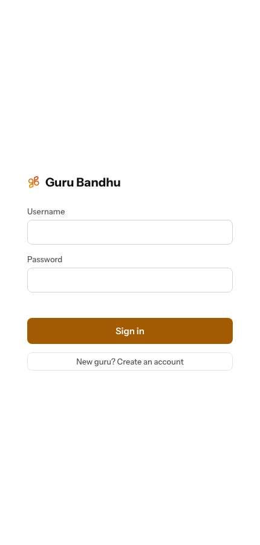
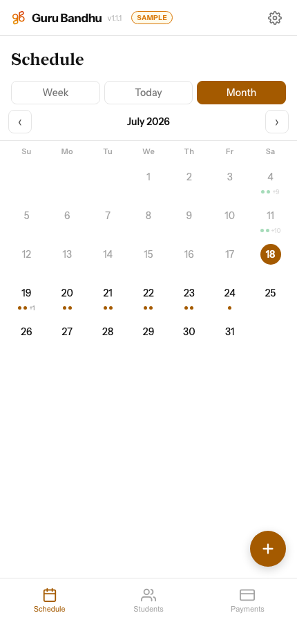
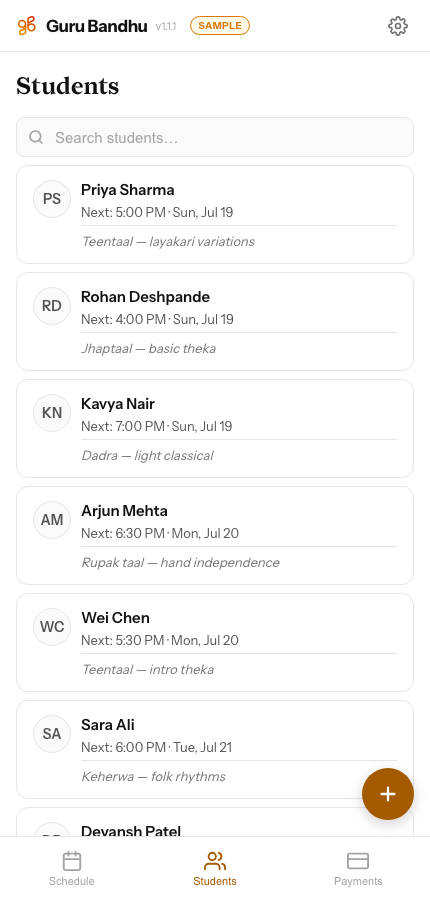
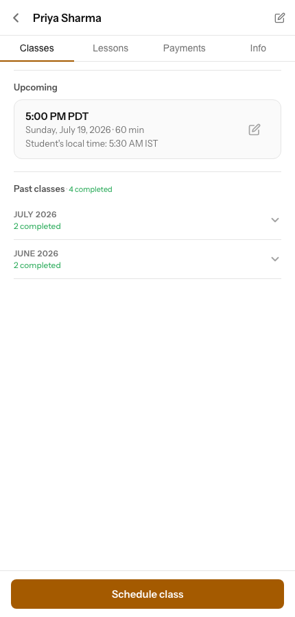
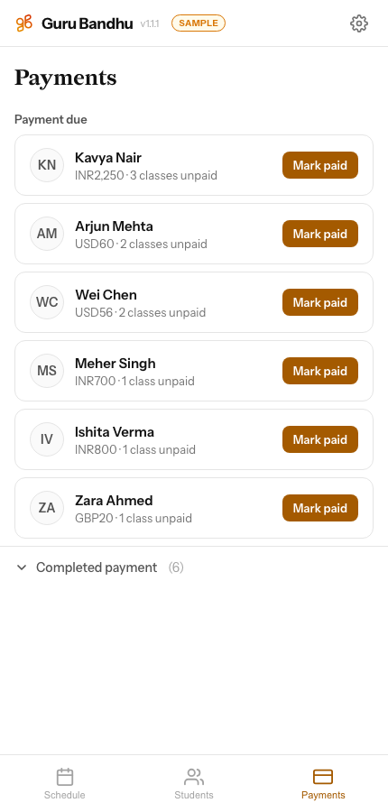

# Guru Bandhu

A student, schedule, and payment tracker for music teachers — built for a tabla guru managing lessons across time zones, and open to any teacher who wants the same.

Each teacher gets their own account and their own private set of students. Nothing is shared between accounts.

## Screenshots

| Sign in | Schedule | Students |
|---|---|---|
|  |  |  |

| Student detail | Payments |
|---|---|
|  |  |

## Features

- **Students** — searchable list, full contact info, per-student class rate, currency, and payment cadence
- **Schedule** — week and month views of upcoming classes, with each student's local time shown alongside yours
- **Payments** — automatic "amount due" based on completed classes vs. classes paid for, one tap to mark paid
- **Class history** — every past class grouped by month, with completed/missed status
- **Compositions / lesson notes** — track what each student is currently learning
- **Archive** — retire a student without deleting their history
- **Sample data mode** — new accounts can preview the app with realistic example students before entering any real data. Toggled from Settings; never touches or overwrites real data
- Installable as a PWA (works offline-tolerant, add-to-home-screen on iOS/Android)

## How accounts work

Sign-up is self-service but gated by a shared invite code — teachers who have the code can create their own account directly from the login screen. There's no cross-account visibility: every student, schedule, and payment record is scoped to the account that created it.

## Tech stack

- **Frontend**: a single-file PWA — plain HTML/CSS/JS, no framework, no build step, no CDN dependencies
- **Backend**: Flask + SQLite, one flat key-value table per account (`students`, `settings`), plus an `accounts` table for login
- **Auth**: signed-cookie sessions, passwords hashed with PBKDF2

## Self-hosting

```bash
python3 -m venv .venv && source .venv/bin/activate
pip install flask
SECRET_KEY=<random-string> SIGNUP_CODE=<invite-code> python app.py
```

Or with Docker:

```bash
docker compose up -d --build
```

`docker-compose.yml` expects a `.env` file with `SECRET_KEY` and `SIGNUP_CODE` — both are required. Data persists to `./data/guru-app.db`.

To create or reset an account without going through signup:

```bash
docker exec -it guru-app python create_account.py
```
